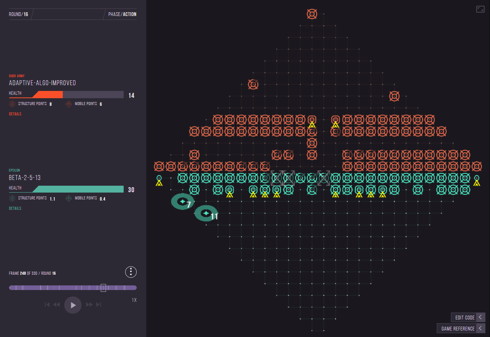

# Codebase for the 2025 High School Terminal

5th Place in the 2025 High School Terminal (North America).
Here is the codebase for our team submission in Citadel's correlation-one high-school terminal challenge.

As described by Correlation One, Terminal is an AI game where you can compete by programming algorithms and battling them against each other in a live e-sports tournament. More details and game rules can be found [here](https://terminal.c1games.com/rules).

### General Project Structure
The final submitted algorithm can be found in the beta-2-5-13 folder under dwei.exe folder.

Each of our team member's submissions will appear in our respective folders.

|———— dwei.exe  
|———— ng-333  
|———— nithinRavikumar  
